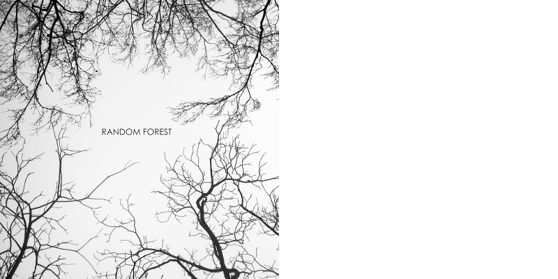
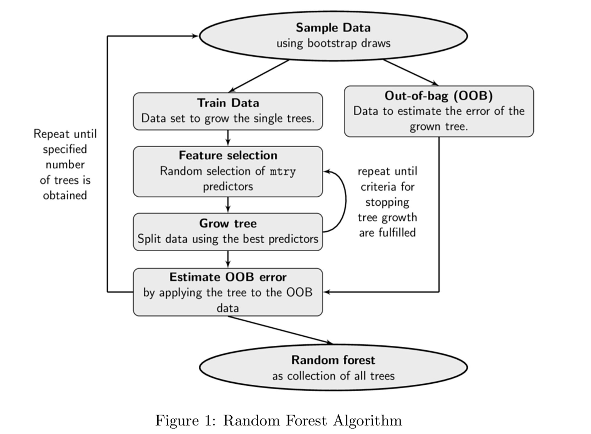

\pagenumbering{gobble}

# Exploration et classification de données

**Eric Normandeau - 2015-01-27**

  

  

\newpage
\LARGE

# Club de Bioinformatique de l'IBIS

## Objectif
- Partager connaissances en bioinformatique
- Similaire aux Interlabs IBIS
- Dimension analyses (analyses, programmes, code...)
- Exposer son expérience personnelle
- Pas simplement présenter des articles
- Différent de ma présentation

## Disponibilité
- Présentations et le matériel mis en ligne
- [Page GitHub du Club de Bioinfo de l'IBIS](https://github.com/enormandeau/club_bioinfo_ibis)

\newpage

# Exploration et classification de données
## Objectifs
- Découvrir 3 techniques statistiques
- Exploration et de classification de données
- PCA, LDA, Random Forest
- Tester ces techniques dans R
- Faire un survol superficiel

\newpage

# PCA

\newpage

# PCA
## Description
- Explorer les sources de variances principales.
- Variables qui caractérisent des échantillons.
- Importance de différentes sources de variation.
- Aucune connaissances *a priori* des données.
- Non-supervisée (untrained).
- Visualiser le regroupement 'naturel' des données.
## Limites
- Compliqué : *p-valeur* des variables par axe.
- Plutôt, descriptif.

\newpage

# LDA

\newpage

# LDA
## Description
- Classification d'individus (sains, infectés...).
- Connaissance *a priori* de la classification.
- Supervisée (trained).
- Problème de classification.
- Visualisation.

## Limites
- Grand nombre d'échantillons d'entraînement.
- Moins approprié/puissant si grand nombre de variables.
- Données à classer doivent être similaires aux données test.

\newpage

# Random Forest

\newpage

# Random Forest
## Description
- Méthode récente (algoritme publié en 2001).
- Classification ou régression.
- Connaissance *a priori* de la classification.
- Supervisée (trained).
- Problème de classification ou de régression.
- Visualisation.

 

\newpage

# Random Forest
## Utilité en biologie/génétique/génomique
- Très approprié si le nombre de variables est très élevé.  
  (Expression de gènes ou marqueurs SNPs)
- Classification d'individus en catégories.  
  (Individus sains ou infectés)  
  (Individus comme bio-marqueurs de pollution)
- Identifier variables importantes (valeur d'importance).
- Prédiction de réponse par régression.

\newpage

# Random Forest
## Limites
- Méthode encore plutôt nouvelle.
- Valeur d'importance réduite pour marqueurs génétiques liés.
- Données à classer doivent être similaires aux données test.

